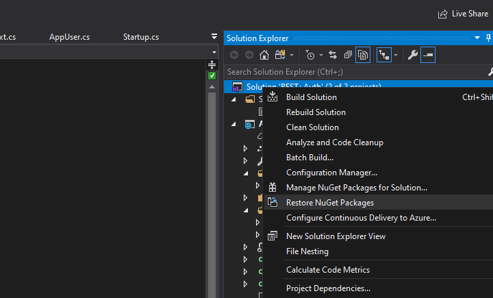
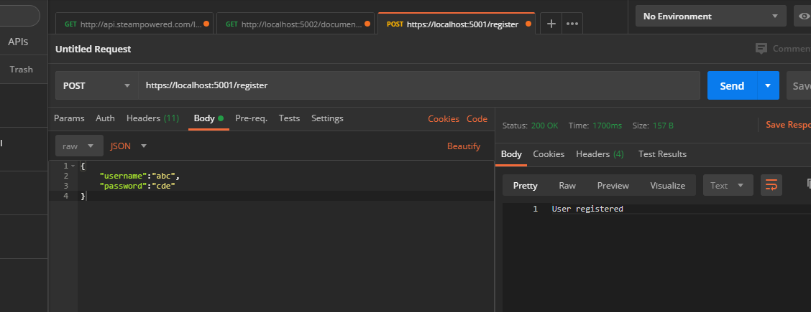
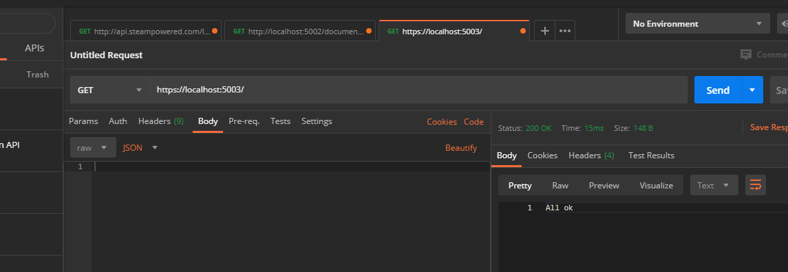
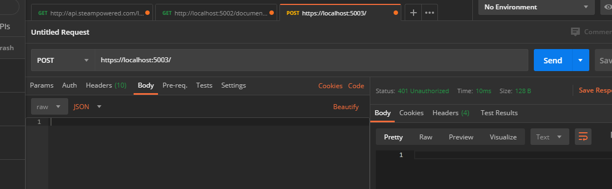
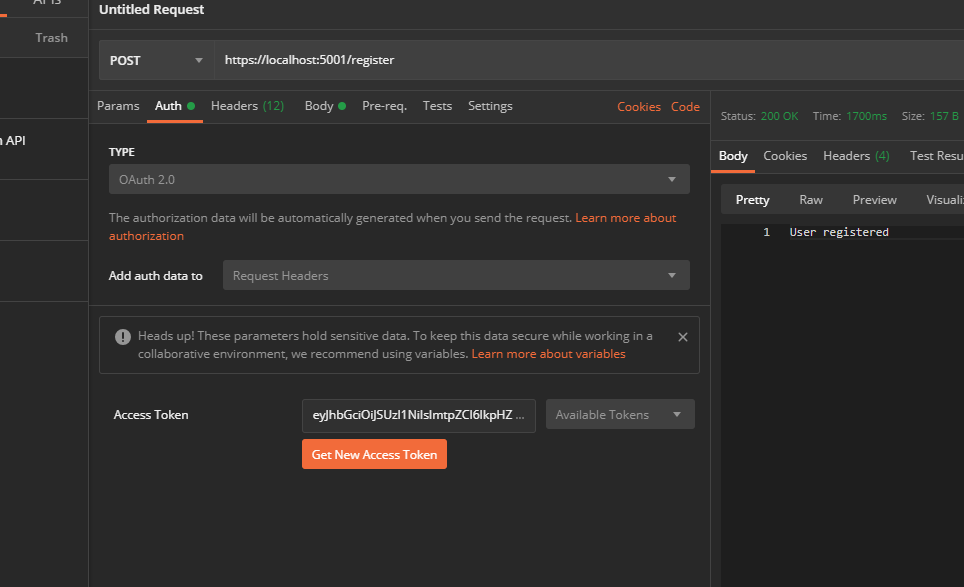
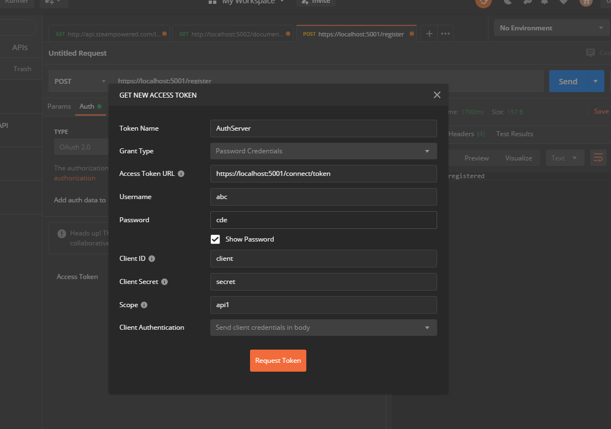
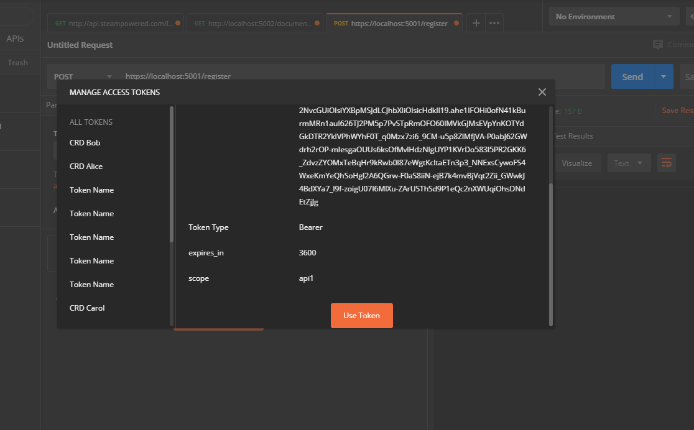
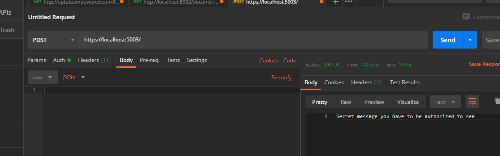
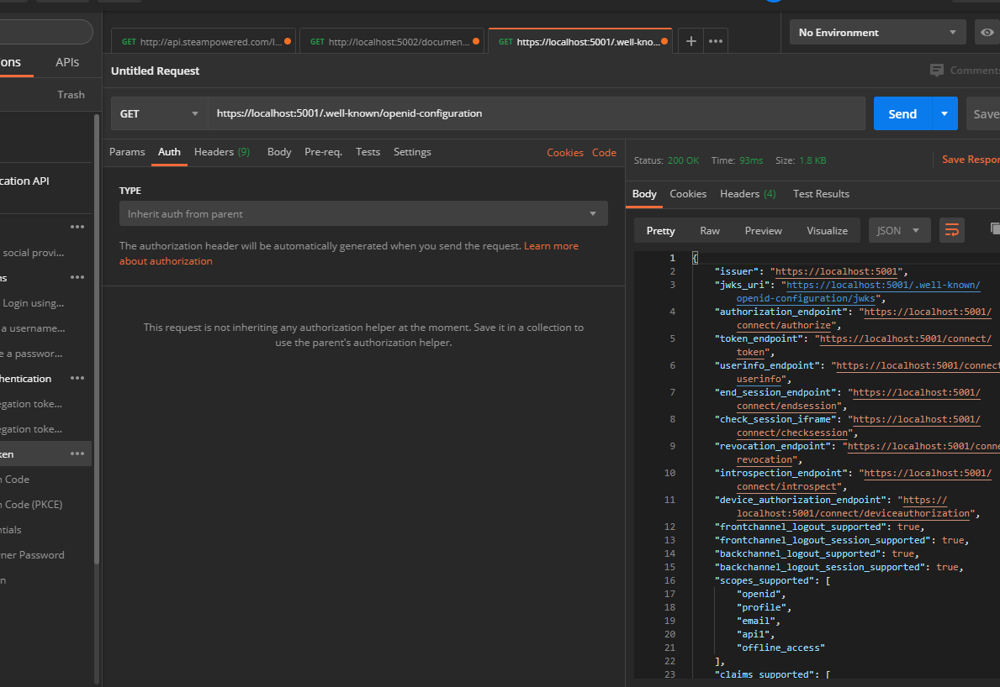

# ASP.NET Core WebAPI - IdentityServer4 minimal solution

(if you found this project helpful, consider [buying me a coffee](https://www.buymeacoffee.com/LXmnx8A) )

1. Restore NuGet packages using solution options.

2. Open Package Manager Console and set directory to AuthServer. Then use commands `dotnet ef migrations add Initial` and `dotnet ef database update` to create table in database. Remember to set data in `appsettings.json` to fitting ConnectionString. You also need some database engine, SSMS will be enough.

3. Run both projects - debug options of solutions should be already set on it. If not, use `dotnet run` from both directories. AuthServer should operate on ports 5000 and 5001, ResourceAPI should be on 5002 and 5003.

4. Install and use Postman to test ResourceAPI. You should discover that GET method returns generic OK response, but POST method says you are not authorized.

GET:

POST:

5. AuthServer has set up simple mechanism for registering new users. Send following message to create new user, `abc` with password `cde`:

6. Now use OAuth2 protocol to get authentication from IdentityServer4. In Postman go into Auth tab, set OAuth2 and write it like this:

7. Now you are able to access protected data from POST method.

Also, if you are confused with OAuth2 protocol, you can access it from https://localhost:5001/.well-known/openid-configuration

